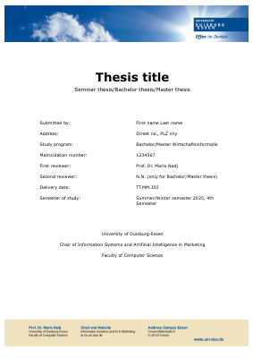
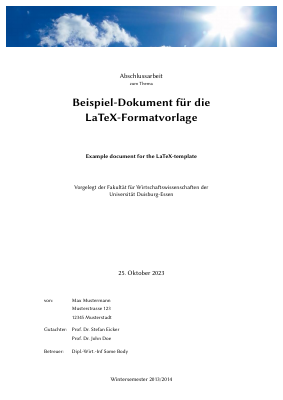
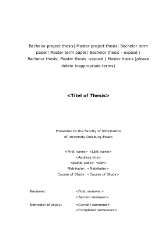
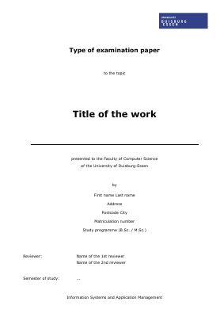

# Typst templates for the University of Duisburg-Essen 📖

This repository provides **unofficial** [Typst](https://typst.app/) templates for the [University of Duisburg-Essen](https://www.uni-due.de/). Currently, templates for the following chairs are supported:

- **AI:** Chair of Information Systems and Artificial Intelligence (AI) in Marketing (Prof. Dr. Mario Nadj)
  - version: no version, last updated in December 2025
- **SOFTEC:** Lehrstuhl für Wirtschaftsinformatik und Softwaretechnik (Prof. Dr. Stefan Eicker)
  - version: [1.7.1](https://ctan.org/pkg/udesoftec)
- **TM:** Chair of Information Systems and Transformation Management (Prof. Dr. Ralf Plattfaut)
  - version: 1.0
- **APP**: Wirtschaftsinformatik und Applikationsmanagement (Prof. Dr. Mario Schaarschmidt)
  - version: 15.10.2025

**Important Note:** Please ask your supervisor if you are allowed to use Typst and one of these templates for your thesis or seminar paper. Note that these templates are not checked by the University of Duisburg-Essen or any of its chairs for correctness. For this reason, it is highly recommended that you double-check the output with the official Microsoft Word or LaTeX templates to avoid negative effects on grading.

These templates are provided on a best-effort basis. It is highly recommended that you have at least a basic understanding of Typst syntax in order to correctly use these templates and resolve simple issues without help.

## Preview

| AI                             | SOFTEC                                 | TM                             | APP                              |
| ------------------------------ | -------------------------------------- | ------------------------------ | -------------------------------- |
|  |  |  |  |

## Usage

These templates are not (yet) published on the Typst Universe. Therefore, they must be checked out manually:

1. Add this repository to your project as a submodule (or simply create a private fork).
2. Replace the content in `[chair]-template.typ` with your thesis content using the example content as a reference.

## Contributing

Some templates are missing features (e.g., confidentiality notes, _Eidesstattliche Versicherung_, etc.) In these cases, help in the form of an issue or pull request is highly appreciated.

If you would like to add your own template, feel free to open a pull request.
